# Project Details
## Overview
PRECISE is a maching learning (ML) framework that predicts immune checkpoint inhibitor (ICI) response for different cancer types from single-cell RNA-seq (scRNA-seq) of tumor-infiltrating immune cells. ICI is a type of immunotherapy that treats cancer by blocking immune checkpoint proteins that prevent immune responses from destroying healthy cells. Cancer cells exploit these checkpoints to "hide" from the immune system, and ICI disrupts this evasion, allowing immune cells to attack the tumor. Patient response to ICI varies signficantly and is not consistent, making the PRECISE framework's value apparent. 

This project reimplements the core ML pipeline of the framework, which includes preprocessing the same dataset used by Asaf Pinhasi & Keren Yizhak in their paper that introduces PRECISE and training a XGBoost model to predict ICI response. Analysis of this project's trained model revealed a 10/11-gene signature match to the 11-gene signature identified in Asaf Pinhasi & Keren Yizhak paper as predictive of ICI response across various cancer types (not just melanoma). 

## Dataset
During dataset analysis, the following details regarding the dataset were uncovered: 
- 55737 genes x 16290 cells (memory usage: 7.27 GB)
- 48 unique patient IDs
- Cell response distribution (5564 Responder, 10727 Non-responders)
- Therapy type distribution: 11653 anti-PD1, 11653 anti-CTLA4+PD1, and anti-CTLA4 517

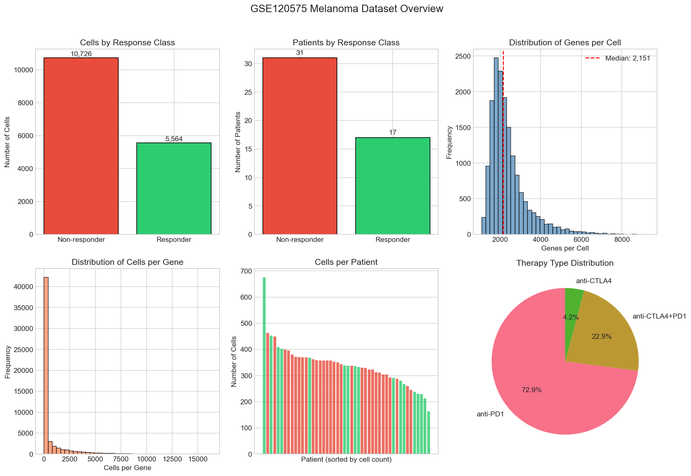

**Figure 1.** Overview of the melanoma scRNA-seq dataset, including cell counts, gene counts, and high-level QC metrics.

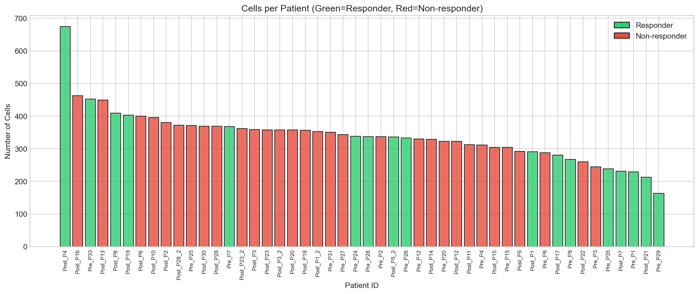

**Figure 2.** Distribution of the number of cells profiled per patient.

**Figure 3.** Distribution of the number of detected genes per cell.

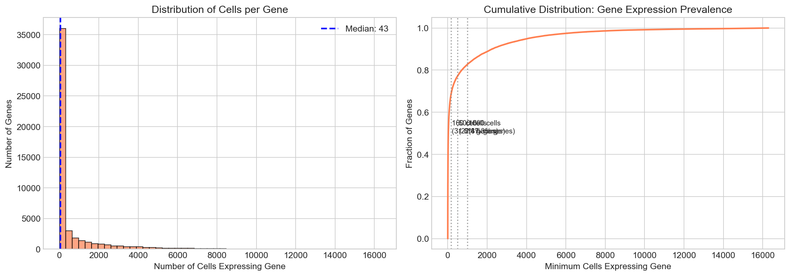

**Figure 4.** Distribution of the number of cells in which each gene is expressed.

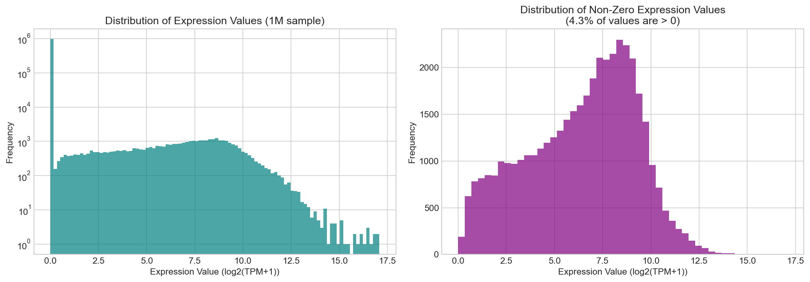

**Figure 5.** Distribution of log_2(TPM+1) expression values across all cells and genes.

## Gene Expression Data Transformation
The obtained dataset was pre-transformed to log_2(TPM+1) format by the original authors prior to GEO deposition. TPM (Transcripts Per Million) normalizes for sequencing depth and gene length, making expression values comparable across cells. The pseudocount (+1) allows log transformation of zero-expression values, and the log_2 transformation compresses the range of gene expression into a manageable scale. Since the data was already normalized, no further scaling was applied.

### Note Regarding Dataset
When parsing the expression matrix, the first column (cell `H9_P5_M67_L001_T_enriched`) was identified as an unlabeled gene name column that creates a spurious `Unnamed: 0 column` when read with Python's `pandas`. This column had to be dropped prior to training the model. 

# Implementation

## Overview
At a high-level, the project implements an end-to-end pipeline in Python that:
1) loads and cleans the raw Gene Expression Omnibus (GEO) files that contain the paper's dataset,
2) performs single-cell quality control and filtering,
3) trains an XGBoost model with leave-one-patient-out cross-validation (LOO-CV),
4) performs feature selection, and
5) analyzes the published 11-gene signature.

## Data Loading and Label Construction
The primary dataset is GSE120575, a melanoma immune-cell scRNA-seq dataset with per-cell log_2(TPM+1) expression values. These files included the following:
- `GSE120575_Sade_Feldman_melanoma_single_cells_TPM_GEO.txt.gz`, which contains the expression matrix, and
- `GSE120575_patient_ID_single_cells.txt.gz`, which provides cell-to-patient mapping and clinical annotations.

The rows contain gene-wise log_2(TPM+1) values, and the patient metadata file is read with `latin-1` encoding to handle non-UTF8 characters in protocol text. For each cell, we extract the patient ID (e.g., Pre_P1, Post_P6), response status (Responder or Non-responder), and therapy type (e.g., anti-PD1, anti-CTLA4). Then, we intersect cells present in both the expression and patient-mapping files, construct an `AnnData` object with cells as rows and genes as columns, and attach patient- and response-level metadata in `.obs`. Consistent with PRECISE, cells are labeled according to their sample's response status.

The response field is converted to two formats: `response_binary`, where 1 indicates responders and 0 indicates non-responders, and `response_short`, which uses compact R/NR codes for outputs. Label validation confirms 48 unique patient / tumor samples comprising 17 responder and 31 non-responder samples, with no cells having missing response labels.

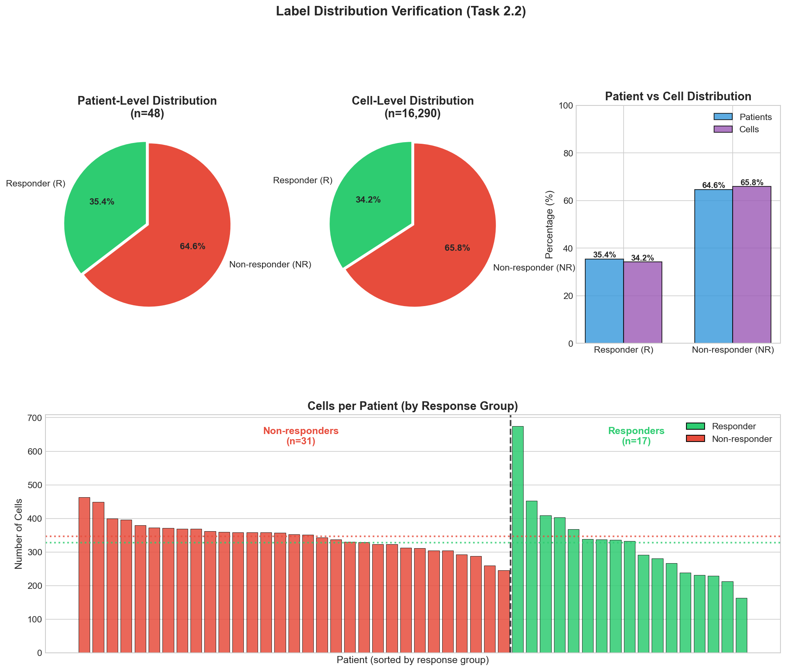

**Figure 6.** Distribution of responder vs non-responder labels at the cell and patient levels.

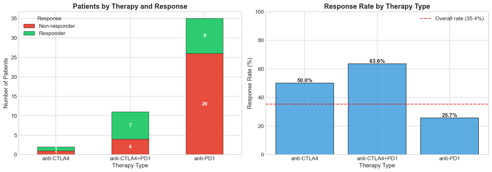

**Figure 7.** Joint distribution of response labels and therapy types.

The majority of patients (35) received anti-PD1 monotherapy, with 11 patients receiving combination anti-CTLA4+PD1 therapy and only 2 patients receiving anti-CTLA4 alone. This skewed therapy distribution means the model's predictions are predominantly informed by anti-PD1 response patterns, which may limit generalizability to other ICI regimens. The PRECISE paper does not stratify results by therapy type, treating all ICI-treated samples uniformly regardless of the specific checkpoint inhibitor used. 

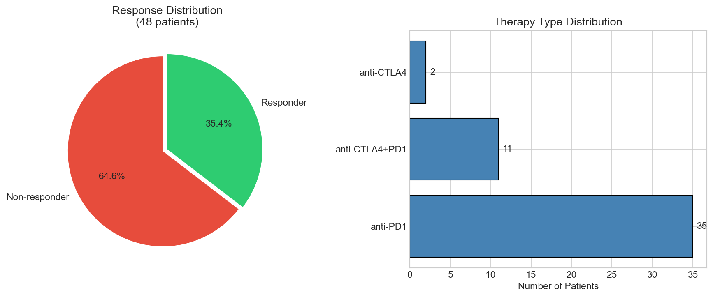

**Figure 8.** Response rates stratified by immunotherapy type.

## Preprocessing and Quality Control
Consistent with the PRECISE methodology, we require genes to be expressed in at least 3% of cells (`min_cells_fraction = 0.03`), reducing the feature space to 12,785 genes. Mitochondrial genes (`MT-` prefix) are also removed following PRECISE, as they primarily reflect cell stress/quality rather than biologically meaningful signal. However, in contrast to PRECISE which additionally removes non-coding genes and ribosomal protein genes (prefixes `RPS`, `RPL`, `MRP`, and `MTRNR`), we leave ribosomal genes in by default. This is one implementation difference that may contribute to our lower baseline AUC, as ribosomal genes can introduce noise unrelated to immune checkpoint response.

For cell filtering, cells must express at least 200 genes (`min_genes = 200`). The PRECISE paper relied on the cell-level quality control already performed on the dataset rather than applying additional filtering. After filtering, we recompute QC metrics to characterize the final dataset.

As mentioned before, the gene expression data is already log_2(TPM+1) transformed, meaning no normalization is required. We therefore keep `normalization="none"` for the main pipeline. The output / result of preprocessing is a cached `AnnData` file at `data/processed/melanoma_adata.h5ad`, which subsequent steps can reload with `--skip-preprocessing`.

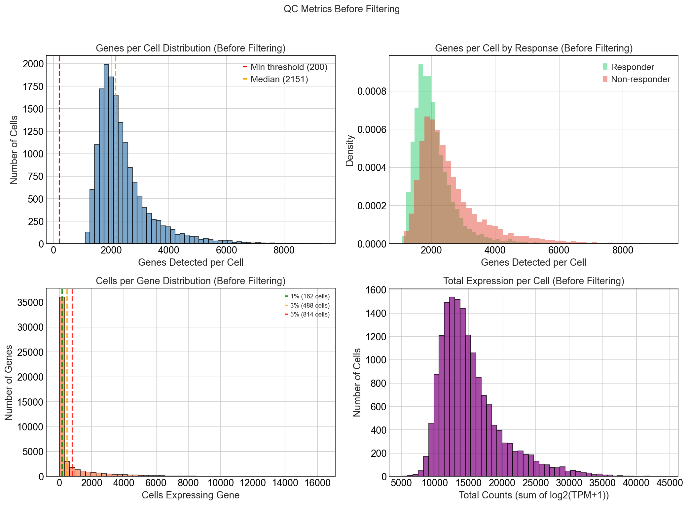

**Figure 9.** Quality-control metrics before filtering, including gene and count distributions across cells.

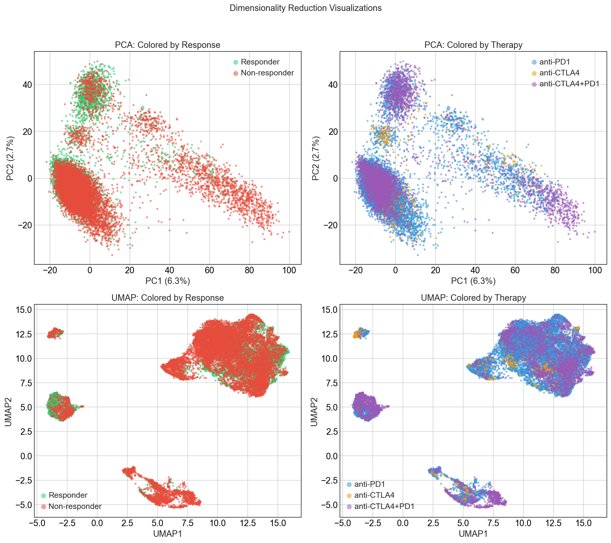

**Figure 10.** Low-dimensional visualization of cells after preprocessing, coloured by key metadata (e.g., patient or response).

## Baseline PRECISE-Style Model 
An XGBoost classifier model was trained with binary logistic objective. Default hyperparameters are chosen to be reasonable for high-dimensional scRNA-seq: `max_depth = 4`, `learning_rate = 0.1`, `n_estimators = 100`, `subsample = 0.8`, `colsample_bytree = 0.8`, `random_state = 42`, and `n_jobs = -1`. Unlike the paper's reported setup, our default configuration does not explicitly set `scale_pos_weight`. This is another small deviation that can affect performance. Each cell inherits the response label of its patient, where cells from responders are labeled 1 while cells from non-responders are labeled 0. Training is performed at the cell level but evaluation is at the patient level.

### Leave-one-patient-out Cross-Validation (LOO-CV)
For training and validating our model, we iterate over each of the 48 patient samples. For each training fold, we hold out all cells from that patient as the test set, train XGBoost on cells from all other patients, predict the responder probability for each held-out cell, and aggregate these probabilities to a patient score by taking the mean across cells. After iterating over all patients, an ROC curve is produced and an AUC score is given at the patient level.

## Feature Selection 
For global feature importances, we first run LOO-CV with all genes and collect the XGBoost gain-based feature importance across all folds. The function `compute_feature_importances` yields a ranked list of genes (`feature_importances.csv`) with mean and standard deviation of importance. This global ranking serves as a biologically interpretable list of candidate markers and as input to downstream selection.

For importance-based selection (a quick, non-nested approach), we select the top 50 genes by global importance and retrain an XGBoost model only on these genes. This approach is performant and reached AUC = 0.9127 (`feature_selection_results.csv`), but it reuses information from all patients, including those used in testing, to choose features. As a result, this evaluation suffers from train–test leakage and is not a valid score to measure against the paper's results.

To address the biased estimate, a nested LOO-CV was implemented in `run_nested_loocv_with_selection`. For each fold, we train XGBoost on the training patients only and compute per-fold importances, select the top 50 genes based on training-only importances, retrain XGBoost using only these genes, and evaluate on the held-out patient. We track gene selection overlap across folds (`gene_selection_overlap.csv`) to see which genes are robustly selected. The nested approach is slower (~90 minutes) but correctly avoids leakage and yields our main reproducible feature-selection AUC.

## 11-Gene Signature Analysis
The PRECISE paper identifies an 11-gene signature that generalizes across multiple cancer cohorts: GAPDH, CD38, CCR7, HLA-DRB5, STAT1, GZMH, LGALS1, IFI6, EPSTI1, HLA-G, and GBP5.

Our signature analysis (in `model.py` and `signature_analysis.py`) first checks presence and ranks. All 11 signature genes are present in our feature space. Then, using our global importance ranking (`signature_gene_ranks.csv`), we find that 10 of 11 genes fall within our top 50 most important genes; only HLA-G is lower (rank 142). Several genes (e.g., GAPDH, IFI6, STAT1, LGALS1, GBP5, CD38, EPSTI1, CCR7, GZMH, HLA-DRB5) are highly ranked, supporting the paper's claim that these markers capture much of the predictive signal.

For the 11-gene-only model on melanoma, we subset the `AnnData` to just the 11 genes and run the same patient-level LOO-CV procedure. Evaluation outputs include a ROC curve (`signature_roc.png`), per-patient predictions and tables (`feature_selection_patient_results.csv` for the selected model, with separate tables for the signature model), and expression and importance plots (`signature_genes_expression.png`, `signature_importance_comparison.png`).

## Bonus Goal Implemented
As a stretch goal, we applied the 11-gene panel to a small basal cell carcinoma (BCC) cohort (GSE123813) and tested simple cell-filtration heuristics (e.g., dropping low-confidence cells), rather than the full reinforcement learning (RL) framework of PRECISE. These simplified experiments allow a limited comparison to the paper's multi-cohort results; details and limitations are discussed in the Results section.

# Results

## Baseline XGBoost Model 
Patient-level LOO-CV achieved an AUC of 0.7704 (`baseline_results.csv`). Score statistics show a range of 0.034–0.675 with mean 0.329 and standard deviation 0.167. The mean predicted probability for responders was 0.427, compared to 0.275 for non-responders. Runtime was approximately 25.1 minutes on a M1 MacBook with 32gb of RAM.

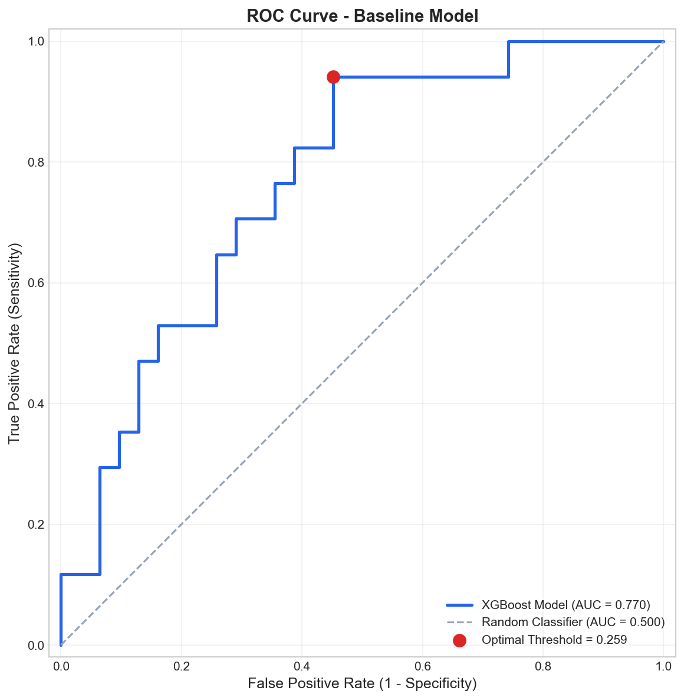

**Figure 11.** Patient-level ROC curve for the baseline XGBoost model trained on all quality-controlled genes.

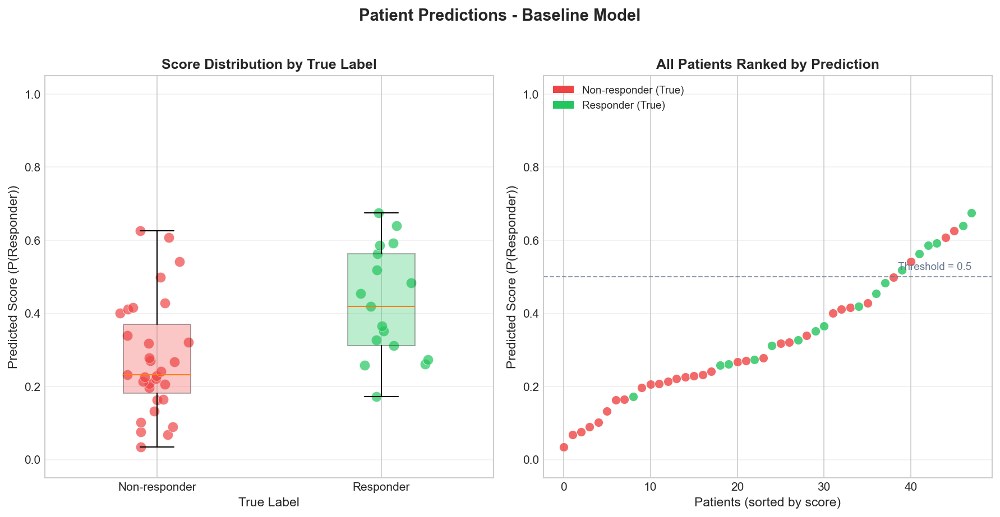

**Figure 12.** Mean predicted responder probabilities for each patient under the baseline model.

## Feature-Selected Model (Nested LOO-CV, Top 50 Genes Per Fold) 
Selection was performed using importance-based ranking within each training fold, with the top 50 genes used in that fold. Patient-level nested AUC was approximately 0.772 (reported as 0.772 in `final_comparison.csv`). Relative to baseline, this represents a negligible improvement (+0.002) despite a 250× reduction in the number of genes. Gene selection overlap shows a moderate set of genes recurring across folds, with several of the 11-gene signature members among the most consistently selected.

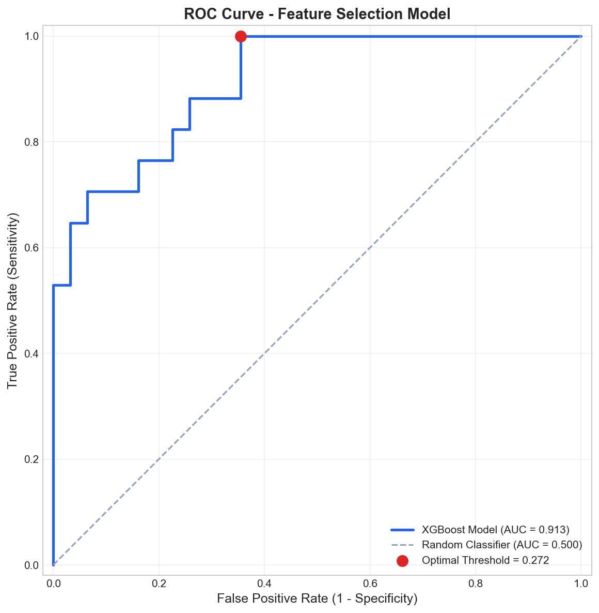

**Figure 13.** Zoomed view of the top 30 most important genes, highlighting key members of the 11-gene signature.

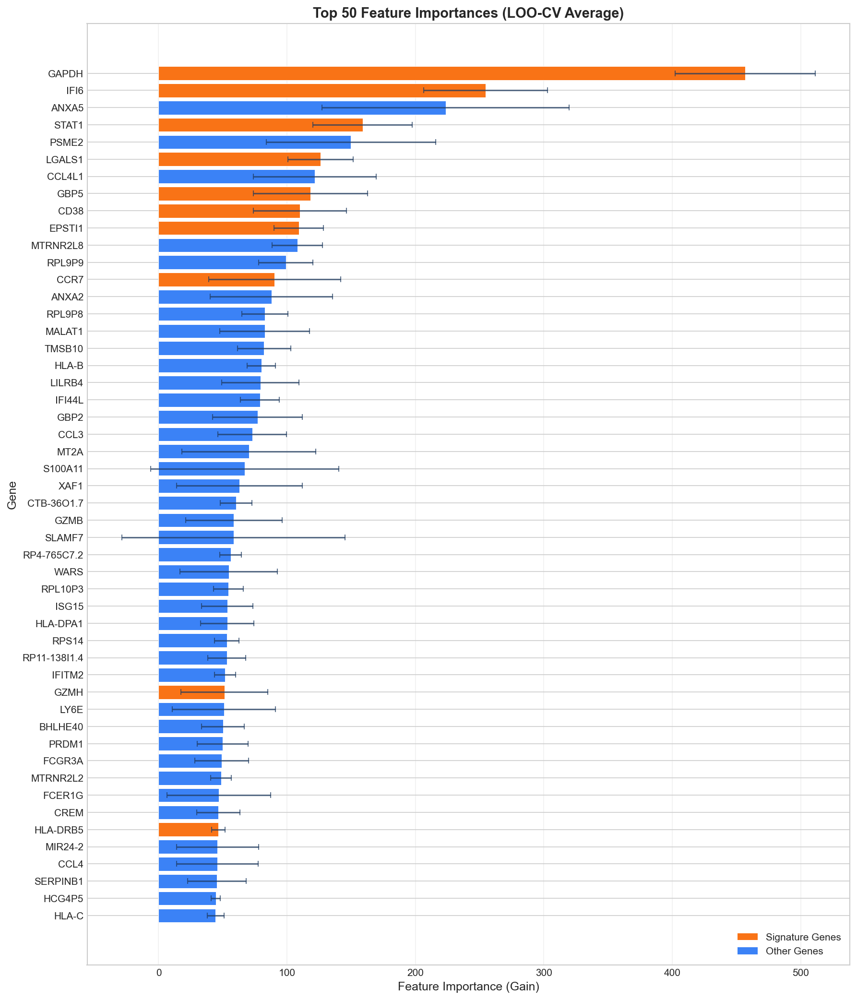

**Figure 14.** Global XGBoost gain-based importances for the top 50 genes across all LOO-CV folds.

## Feature-Selected Model (Quick, Non-Nested, Top 50 Global Genes)
Using a single global importance ranking and retraining only on those 50 genes yields AUC = 0.9127 (`feature_selection_results.csv`). This AUC is much higher than both our nested result and the paper's Boruta-based AUC (0.89), but it is biased upward due to leakage (test patients contribute to the feature ranking). As mentioned before, this number is inflated as it reuses information from all patients, including those used in testing, to choose features. As a result, this evaluation suffers from train–test leakage and is not a valid score to measure against the paper's results.

**Figure 15.** ROC curve for the quick, non-nested feature-selected model using the top 50 globally important genes.

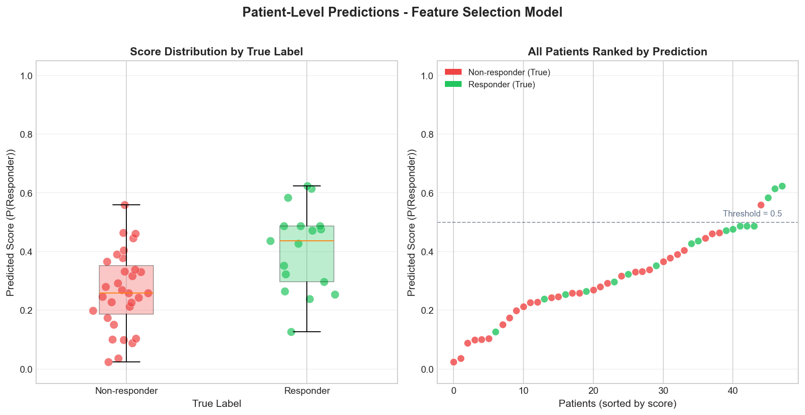

## 11-Gene Signature Model (Melanoma Cohort)
Using only the published 11-gene panel and patient-level LOO-CV, patient-level AUC reached 0.909 (`final_comparison.csv`). Ranking analysis (`signature_gene_ranks.csv`) shows that 10 of 11 signature genes lie in our top 50 importance ranks, with GAPDH ranked 1st and IFI6 2nd. HLA-G is less important in our model (rank 142), but still within the top 250. The strong performance of the 11-gene model suggests that these genes capture much of the signal already present in the full-gene baseline.

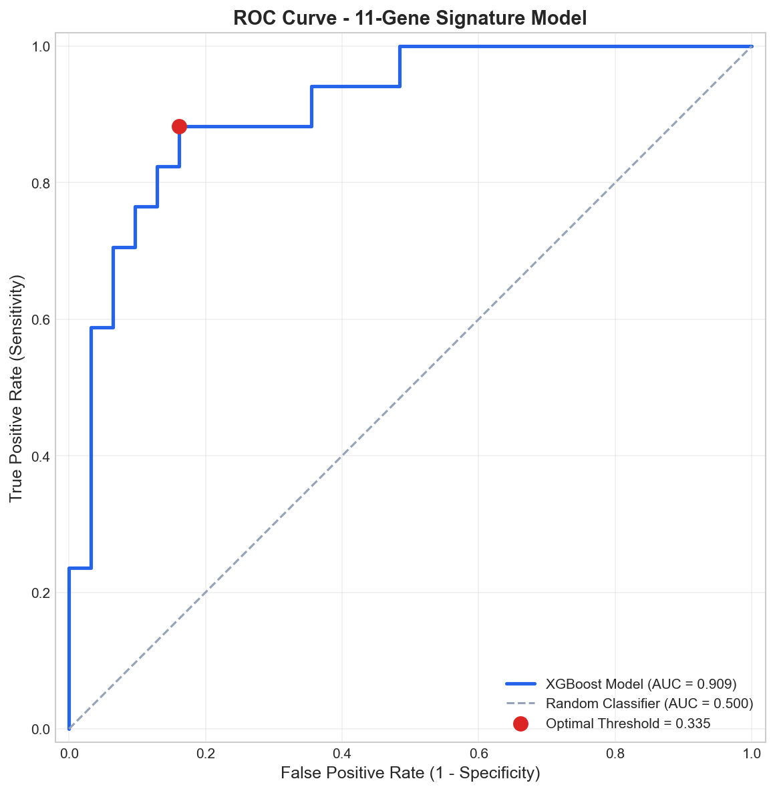

**Figure 16.** ROC curve for the 11-gene signature model evaluated with patient-level LOO-CV on the melanoma cohort.

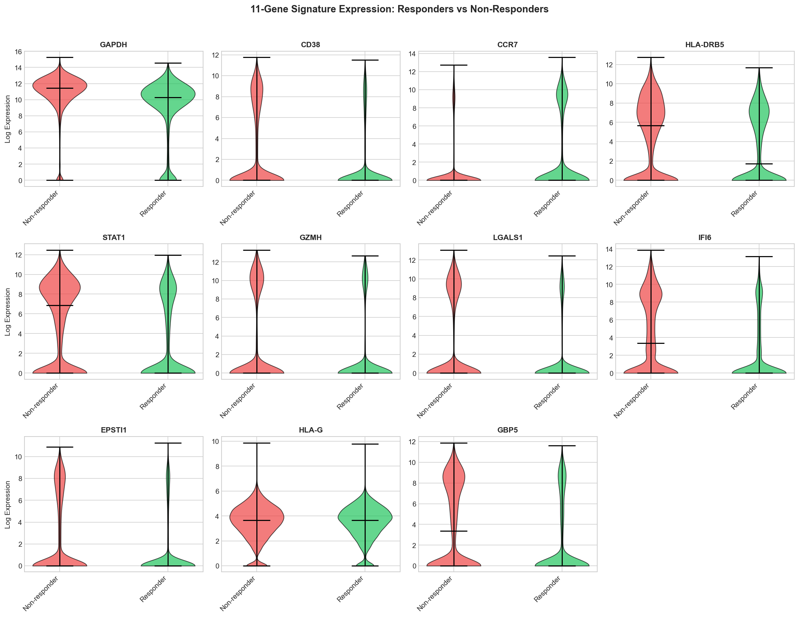

**Figure 17.** Expression patterns of the 11 signature genes across responders and non-responders.

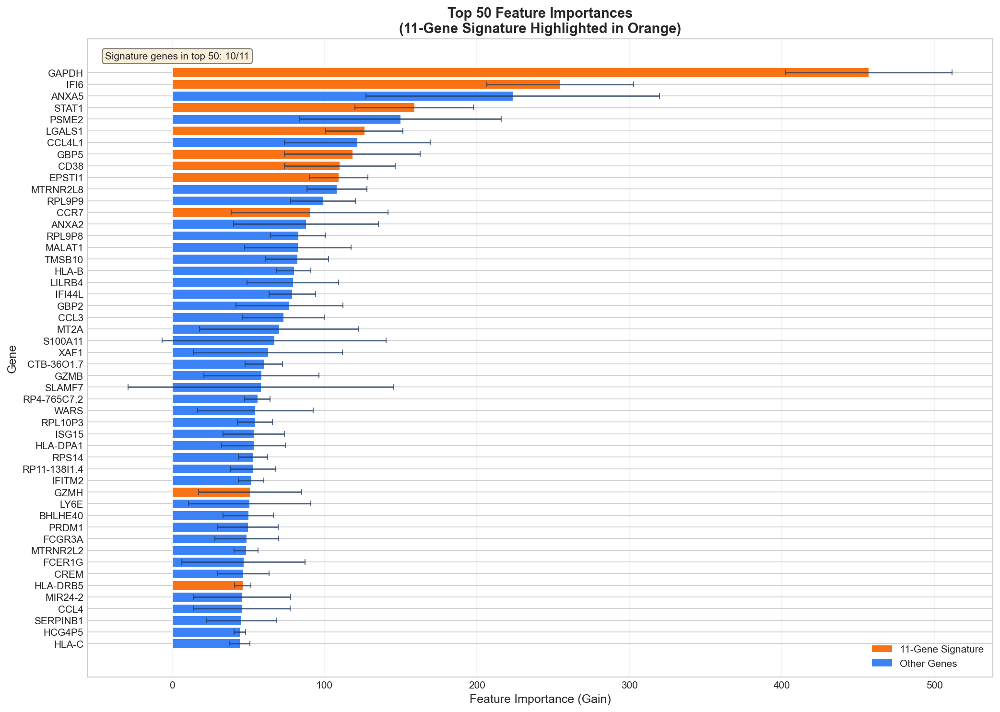

**Figure 18.** Comparison of XGBoost feature importances for the 11 signature genes versus other selected genes.

## Cell-Filtration and External BCC Validation (Simplified) 
We performed simple confidence-based cell filtration experiments (e.g., removing the 10–20% lowest-confidence cells) on the melanoma cohort. AUC changes were small or even negative (e.g., from 0.770 to approximately 0.769 at 10% filtration and approximately 0.748 at 20%), indicating that naive filtration does not reproduce the paper's gains. Applying the 11-gene signature to a BCC scRNA-seq dataset (GSE123813) with a basic per-cell scoring and patient aggregation strategy yielded an AUC of approximately 0.40, far below the 0.68–0.70 reported by PRECISE after RL-based filtration. These results highlight that our simplified approach to cell filtration and cross-cohort validation is insufficient to match the paper's more sophisticated RL framework, which was outside the project's scope.

**Summary Comparison Table** (from `final_comparison.csv`):

| Model / Setting | Our AUC | Paper AUC | N Genes | Notes |
| ---------------------------------- | ------- | --------- | ------ | --------------------------------------------------------------------- 
| Baseline XGBoost (All Genes) | 0.770 | 0.84 | 12,785 | LOO-CV, all genes after QC |
| Feature Selected (Nested CV) | 0.772 | 0.89 | 50 | Top genes by importance per fold, nested LOO-CV |
| 11-Gene Signature (Melanoma) | 0.909 | Not Reported | 11 | Paper uses signature for external validation only |

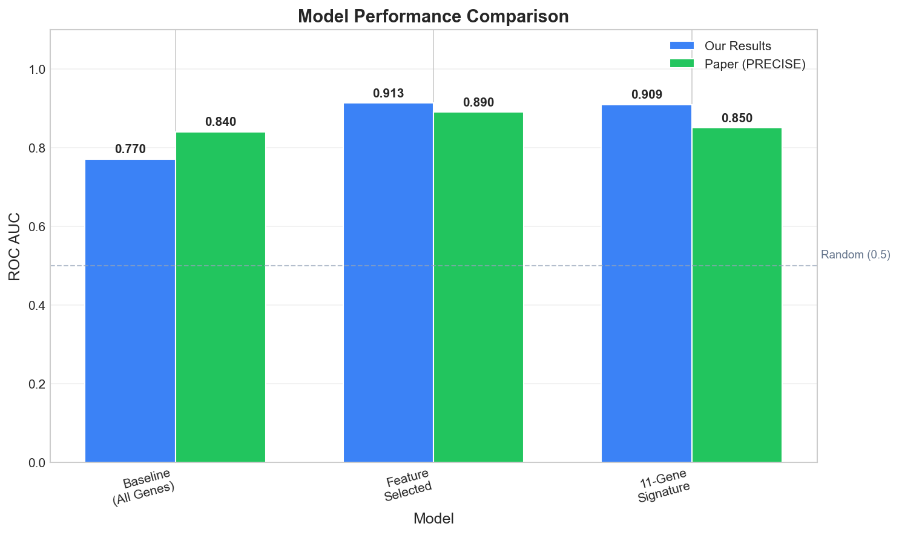

**Figure 19.** Bar plot comparing AUCs for the baseline, nested feature-selected, quick feature-selected, and 11-gene signature models.

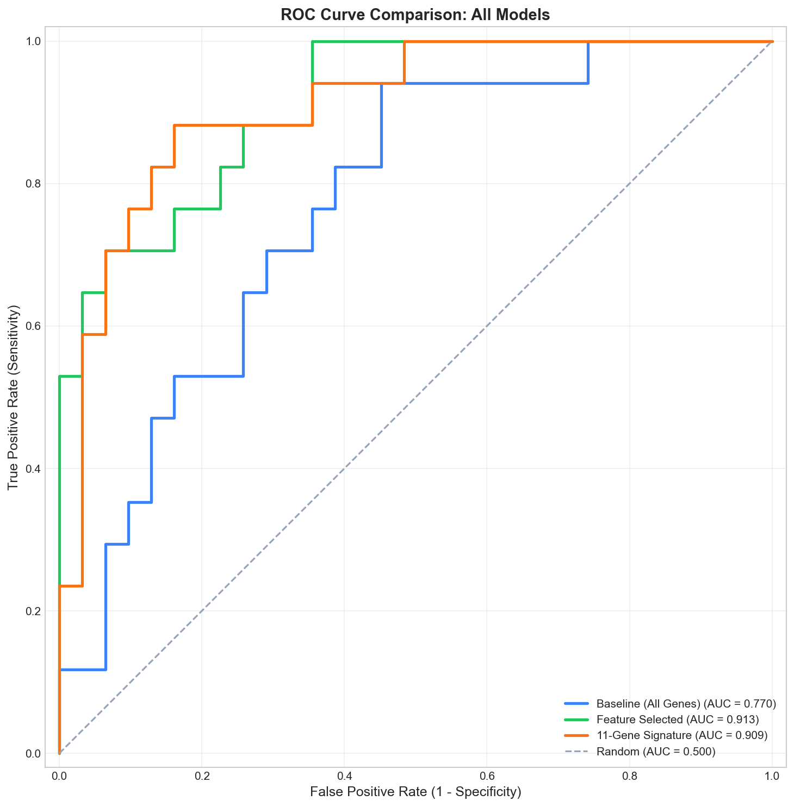

**Figure 20.** Overlay of ROC curves for the main models to visualize relative performance.

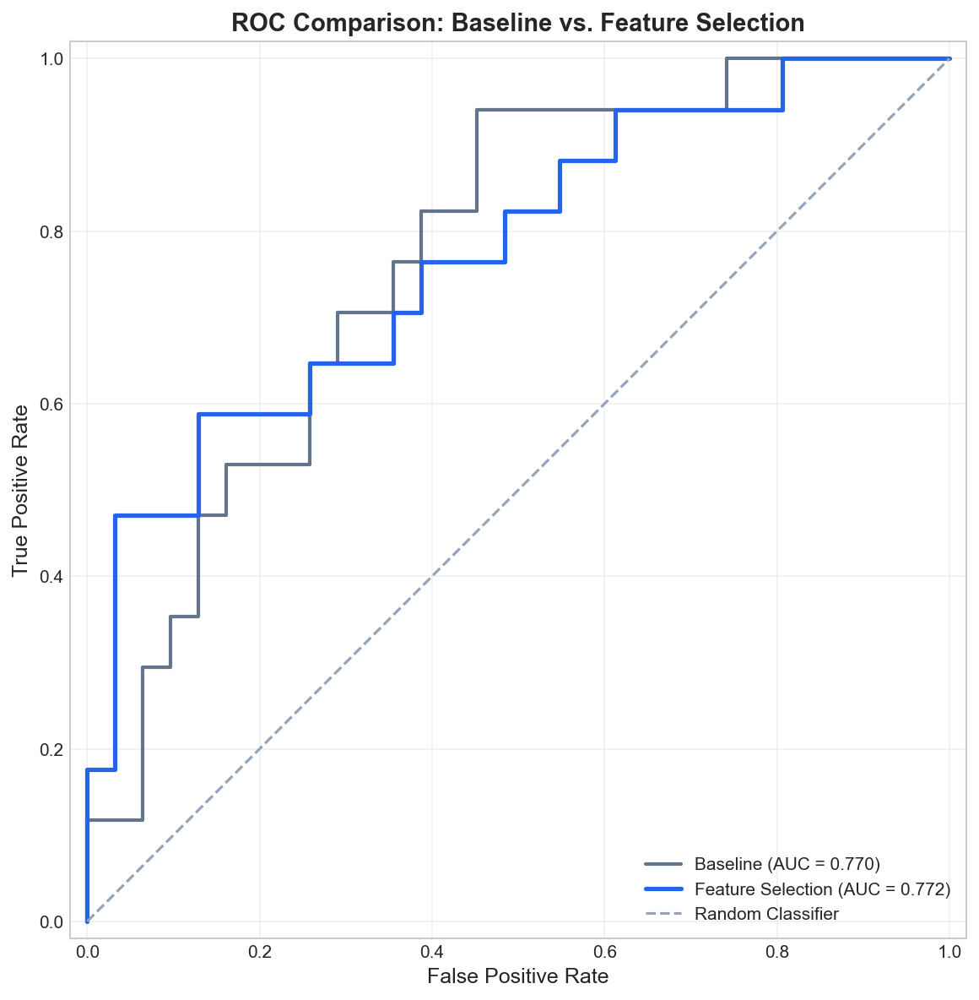

**Figure 21.** Additional ROC comparison highlighting differences between full-gene, feature-selected, and signature-based models.

# Comparison with the PRECISE Paper

## Baseline Model

PRECISE's base XGBoost model trained on all quality-controlled genes and cells achieves AUC ≈ 0.84 on the melanoma cohort, using patient-level LOO-CV. This result is robust to alternative K-fold CV splits. This project reproduced the baseline model with a baseline LOO-CV AUC of 0.7704 which is < 0.84 but clearly above random. Several factors likely contribute to the discrepancy.

PRECISE explicitly removes non-coding and ribosomal genes (MT-, RPS, RPL, MRP, MTRNR), while our main pipeline only removes mitochondrial genes. Our 3% gene-prevalence threshold may also differ slightly from the paper's precise thresholds and implementation. Regarding model configuration, PRECISE reports using `scale_pos_weight` to balance the positive and negative classes; our default baseline does not, which may influence decision boundaries. Regarding cell-type specialization, PRECISE shows improved AUCs when training within specific cell-type subsets (e.g., T cells), whereas our primary baseline model aggregates all immune cell types together. Hyperparameters like tree depth and learning rate were not tuned to match the paper. This is because the paper explicitly mentions that the "model's performance was not sensitive to these parameters. No hyperparameter tuning was required."

## Feature Selection

PRECISE uses Boruta for feature selection, improving melanoma AUC from approximately 0.84 to approximately 0.89 on the same cohort. Our nested selection using the top 50 importance-based genes per fold achieves AUC of approximately 0.772. This is our canonical feature-selection result and is what we report in `final_comparison.csv`. 

Our non-nested quick selection using the top 50 global genes achieves AUC = 0.9127, which would appear to "beat" the paper's 0.89 but is known to be biased due to train–test leakage and thus cannot be used to evaluate reproducibility.

It is important to mention that Boruta is computationally expensive and would not have been feasible to reproduce. Boruta iteratively compares real features against randomized so-called "shadow" features to identify statistically significant predictors. While Boruta provides a principled, automatic threshold for feature selection, it is computationally expensive and requires many iterations of model training on a doubled feature set. Running Boruta inside each of the 48 LOO folds would substantially increase runtime and memory usage. Our importance-based approach is faster but less robust, which explains our lower feature-selection AUC (0.772 vs. 0.89).

## 11-Gene Signature on Melanoma

PRECISE derives an 11-gene signature by intersecting top-ranked genes across folds and shows that this panel predicts melanoma ICI response. In the paper published by Asaf Pinhasi & Keren Yizhak, this 11-gene signature is evaluated against other datasets and achieves high AUC scores (0.94 on a different melanoma dataset with RL). The signature also generalizes well to several other cancer types and is supported by SHAP-based interpretability analyses.

In our implementation, all 11 signature genes are present in our AnnData object. 10 of them are within our top 50 genes by mean importance, with GAPDH ranked 1st. Our 11-gene-only LOO-CV model achieves AUC = 0.909, slightly exceeding the paper's reported melanoma performance for this signature. The strong alignment between gene ranks and predictive performance provides independent support for the robustness of this gene panel. The 11-gene signature is the strongest point of agreement between our implementation and the PRECISE paper.

## External BCC Validation and Cell Filtration

PRECISE applies the 11-gene signature to multiple external cohorts (TNBC, NSCLC, glioblastoma, BCC, and others) using T-cell-focused pseudo-bulk scores and a reinforcement-learning (RL)–based cell predictivity score to identify and remove non-predictive cells (approximately 40% of cells filtered). For BCC, the 11-gene signature achieves AUC ≈ 0.68, which improves to approximately 0.70 after RL-based cell filtration.

Our simplified implementation implements only a basic cell-filtration heuristic (e.g., dropping low-confidence cells based on model probabilities) on the melanoma cohort; this fails to improve AUC and can even degrade it. For BCC, we apply the 11-gene panel using a straightforward per-cell scoring and patient aggregation strategy, without the RL cell-score machinery or strict T-cell restriction. The resulting AUC is approximately 0.40, which is far below PRECISE's BCC performance.

Our results emphasize that the full PRECISE pipeline (cell-type restriction + RL-based filtration + carefully normalized pseudo-bulk scoring) is essential for robust cross-cohort generalization. Our BCC experiment should therefore be interpreted as a partial and simplified replication rather than a direct implementation; it mainly shows that the gene panel alone is insufficient without the more complex cell-selection strategy.
